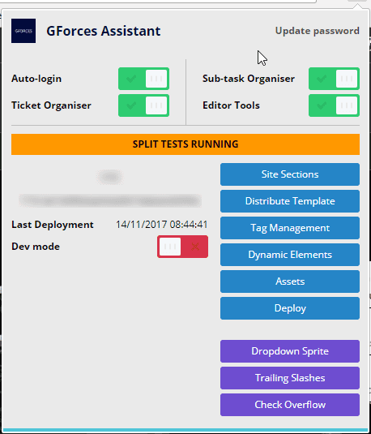

# GForces CSS Assistant #

The GForces CSS Assistant is a chrome extension for use by GForces frontend developers. It holds a variety of features that help make daily life easier.

## Getting set up ##

Ask Beau, or another member of the team to supply you with the chrome store URL.

## Features ##

On JIRA:
- Adjusted styling
- Organise and filter the MS ticket queue
- Automatically reject MS tickets without quotes or due dates
- Highlight MS ticket quotes that are outside of SLA
- Automatically label OEM tickets
- Organise and filter QA sub-tasks in the projects queue
- If a champion of an OEM or device, show quick-reference ticket count
- Check for projects that have been in phase 1 QA for more than 3 days

On V10 Sites (frontend):
- Automatically log into V10 sites with saved and encrypted credentials
- Split-testing notifications
- At a glance S3 bucket & hash information
- Quick access to various sections of the admin area
- Show last deployment date &  time
- Quick dev-mode button
- Dropdown sprite generator
- Check for links without trailing slashes
- Check for elements that are overflowing the boundaries of the window

On V10 Sites (admin):
- Adjusted styling
- Visual Re-ordering of modules in the template editor
- Quick-clone modules
- Styles and functionality added to tag management, to write code in-browser
- Quick-search templates within tag management
- Access commonly-used JS snippets through tag-management (stored in SVN)
- Added features to dynamic elements (Add & Remove all)

## Requirements ##

Google Chrome

## Known Issues ##

- Tag management editor occassionally incorrectly modifies the wrong line on first init
- Firefox compatibility is spotty at best
- Hash, and deployment date & time isn't accurate for sites on the old asset structure

## Release Notes ##

### 1.0.0 ###
- New layout to make room for further features
- Fixed dropdown script bug (it didn't work at all)
- Fixed JIRA ticket counter, when ticket doesn't have Due Date

### 0.23.0 ###
- Added labels for Escalations in JIRA
- QA Sub-tasks now have icons and title attributes applied if there are labels applied 
### 0.22.0 ###
- Added "all" buttons to dynamic elements
- MS Ticket quotes in JIRA are now highlighted if over SLA

### 0.20.0 ###
Removed jQuery dependancy
